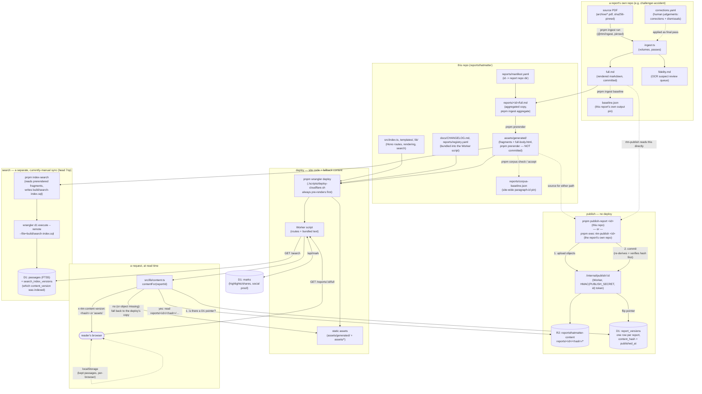

# Architecture

The current shape of the system, kept up to date as it changes. For *what to
do next*, see [issue #77](https://github.com/reportsthatmatter/reportsthatmatter/issues/77)
and Beads (`bd ready`). For house rules, see [AGENTS.md](../AGENTS.md). Older
design docs under `docs/plans/` record how we got here and are not kept
current once superseded by this file.

## The one-line answer to "what needs a deploy?"

**Report text and site code are published independently, through different
mechanisms, by different people/scripts, on different schedules.**

| Change | What to run | Touches the Worker? |
| --- | --- | --- |
| A report's text (a correction, a re-ingest) | `pnpm publish-report <id>` (or the report repo's own `rtm-publish`) | No — writes straight to R2 + flips a D1 pointer |
| Site code, templates, styling, routes | `./scripts/deploy-cloudflare.sh` (`pnpm wrangler deploy`) | Yes |
| A report that has never been published | needs a Worker deploy at least once (it is served from `assets/generated/`, which is baked into the deploy) | Yes, until first published |

All ten reports are currently published (R2-pinned) — check with
`pnpm publish-report <id> --status --base https://reportsthatmatter.org`, or
look for `x-rtm-content-version` on the response: a hash means R2, the literal
string `assets` means the deploy's bundled copy. **A `wrangler deploy` does
not update a report that is already R2-pinned** — this bit us on 2026-09-11:
a full site deploy shipped, `/full` still looked fine on a quick grep for an
*unchanged* phrase, and the actual correction only went live once
`pnpm publish-report` ran. Check the corrected text itself, or the version
header, not just that the page returns 200.

## Diagram

## The two blast-radius gates

Two different things can move, and each has its own pinned baseline —
conflating them once let a fix aimed at Leveson silently change three other
reports:

- **`pnpm ingest check`** — a report's own **markdown** against `baseline.json`
  *in that report's own repo*. Accept a real move with `pnpm ingest baseline <id>`.
- **`pnpm corpus check`** — what this repo **renders from** that markdown:
  every section's citable paragraph ids, against `reports/corpus-baseline.json`
  *in this repo*. Paragraph ids are permalinks (`src/lib/markdown.ts`), one
  stage downstream of anything a report has a pin on, so this is the only
  check that would catch a rendering-code change repointing citations across
  every report at once. Accept a real move with `pnpm corpus accept [<id>]`.

Never accept either to make the check quiet — accept because you read the
diff and meant it. `./scripts/verify.sh` runs both, plus HTTP and browser
checks against a live worker; it is the done condition (`AGENTS.md`).

## Components, briefly

- **A report repo** (`reportsthatmatter/<id>` on GitHub, e.g.
  `challenger-accident`) owns the source PDF(s), `ingest.ts` (which volumes,
  in what order, which passes), `corrections.yaml` (human judgements —
  corrections and dismissals, applied deterministically so re-ingestion is
  reproducible), and the `full.md` / `fidelity.md` / `baseline.json` that
  running the pipeline produces. `reports/manifest.yaml` in this repo says
  where each one lives (`dir: ../<id>`, a sibling checkout).
- **`@rtm/ingest`** is the pipeline library, a separate repo pinned by tag in
  both this repo's and each report repo's `package.json`. A pipeline fix is a
  release there, then a deliberate version bump in whichever `package.json`
  adopts it — never a silent float.
- **This repo (`reportsthatmatter`)** is the Hono/Cloudflare Workers site:
  routes (`src/index.ts`), page shells (`src/templates/`), markdown→HTML and
  search (`src/lib/`), the design system (`assets/styles.css`), and the CLI
  wrapper that runs the pipeline over the whole corpus (`scripts/ingest/cli.ts`).
- **Publishing** (`docs/plans/2026-09-04-content-publishing.md`) writes a
  report's rendered content to R2 under a content hash
  (`reports/<id>/<hash>/…`) and, once every object is verified readable,
  flips one row in D1 (`report_versions`) to point at it. Old hashes are
  never collected, so `--rollback <hash>` is instant and a citation stays
  valid forever, even across a correction. A report repo's own credential
  (`HMAC(PUBLISH_SECRET, report id)`) can only rewrite itself.
- **Deploying** ships the Worker script (with `docs/CHANGELOG.md` and
  `reports/registry.yaml` bundled directly into it — no separate fetch) and
  uploads `assets/generated/` as static assets, which is what serves a report
  with no R2 pointer yet. `assets/generated/` and `build/` are build output
  and are **not committed**; `./scripts/deploy-cloudflare.sh` always
  `pnpm prerender`s first so a fresh clone can't ship empty.
- **Search** is D1 FTS5 (`passages`), built from the same prerendered bytes a
  reader is served (never markdown re-rendered separately) and applied with a
  plain `wrangler d1 execute --file=`. `search_index_versions` records which
  `content_version` was indexed per report, precisely so a publish that
  outruns the next `pnpm index-search` is a detectable staleness rather than
  a silently wrong search result. Making that remote-apply step reliable
  end-to-end is open work (`reportsthatmatter-7np`).
- **Marks** (highlights/shares) are a D1 table plus per-browser
  `localStorage` for a reader's own kept passages — no account, nothing
  cross-device.
- **Work tracking**: Beads (`.beads/`, synced through a Dolt remote — see
  `docs/beads-sync.md`) is the source of truth for agent-actionable tasks.
  GitHub issues hold public discussion, report candidates, and broad epics.
