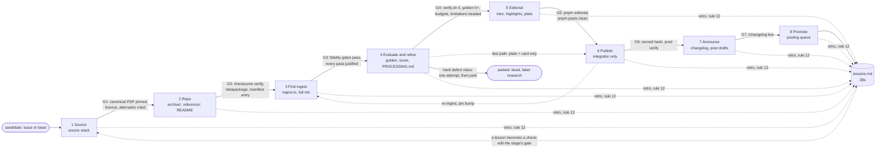

# The report preparation pipeline: eight stages, one skill each

Design for epic reportsthatmatter-ifb5 (children ifb5.1 to ifb5.8). Date: 2026-10-03. Status: first version; the skills under `.claude/skills/report-*/` are drafts written with it.

Rufus, 2026-10-03: a clear pipeline per report: (1) source, finding good-quality versions as well as the original; (2) cache and prepare the repo; (3) propose a first ingest; (4) evaluate and refine; (5) introduction and excerpts, perhaps before publishing; (6) publish; (7) announce; (8) promote with excerpts.

This document says what each stage takes in and hands on, what gates it, which model and which agent run it, how a supervisor moves a report through, where a report's stage is recorded, and how the improvement loop (reportsthatmatter-38s) feeds back. It does not repeat the how-to: the skills point at the real commands and the existing guides ([`report-preparation.md`](../report-preparation.md), [`report-introductions.md`](../report-introductions.md), [`quality-harness.md`](../quality-harness.md), [`scoring.md`](../scoring.md), [`release-checklist.md`](../release-checklist.md), [`posts-queue.md`](../posts-queue.md), [`research/better-source-texts.md`](../research/better-source-texts.md)). Section 9 walks Duelfer Volumes II and III through stages 1 and 2 as a worked example.

## 1. How this relates to the existing stages

[`report-pipeline.md`](../report-pipeline.md) has three shipping stages (text, introduction, imagery), each its own release and Bead. The eight stages here refine them; they do not replace the rule that each release is complete and nothing waits for review.

| report-pipeline.md | This pipeline |
| --- | --- |
| 1. Text (`stage-text`) | 1 Source, 2 Repo, 3 First ingest, 4 Evaluate, then 6 Publish (with the plate and default card from 5) |
| 2. Introduction (`stage-intro`) | 5 Editorial (introduction, highlights, excerpts), then 6 again (a deploy) |
| 3. Imagery (`stage-imagery`) | A sub-track of 5 (hero image), its own Bead, never blocking |
| (not defined) | 7 Announce, 8 Promote |

**Order.** The default is 1 to 8 in order, with 5 before the first publish when it can be done in the same run (an introduction is cheap and ships approved). The fast path 4 → 6 → 5 → 6 stays open: a report's text may ship before its introduction, exactly as today, when the introduction would delay it. Either way the plate and the default share card ship with the first publish (`tests/plates.test.ts` fails without a plate), so that part of stage 5 is always done before 6.

**Re-entry.** A report does not leave the pipeline once published. A pin bump or a source change re-enters at 3 or 4 for that report and comes out through 6 again; aliases (`pnpm aliases generate`) keep stage 5's quotations and stage 8's posted links alive. A further volume (Duelfer II-III, Valukas 5) is a new unit that starts at 1 and joins the existing report id at 6.

## 2. The stages at a glance



| # | Stage (skill) | Entry | Exit gate (all must hold) | Hands on | Model | Owner |
| --- | --- | --- | --- | --- | --- | --- |
| 1 | Source (`report-source`) | A candidate with an impact reason and a named scope (report id plus volumes) | Canonical original identified, downloaded once and its SHA-256 recorded; licence known; text-layer verdict (born-digital or scan, tagged or not); all eight checklist items answered with a source or "none"; version risks (redactions, corrections, reprints) named and resolved or beaded; source stack chosen; scope decision written | The source stack table in the unit's Bead notes; draft requests for Rufus (never sent) | Sonnet | One agent per unit |
| 2 | Repo (`report-repo`) | G1 | Every file in `archive/` and `reference/raw/` verifies against its recorded SHA-256; `datapackage.json` lists each with source URL and licence; README has Scope and Materials (source stack, checklist answers); `reference/manifest.json` built where a reference exists, with its set (development or held-out) decided; `ingest.ts` lists the volumes with checksums; `package.json` pins the site's `@rtm/ingest`; `pnpm ingest preflight` clean; `reports/manifest.yaml` entry | Report-repo PR (branch); site PR with the manifest entry and `REFERENCES` entry | Sonnet | Same agent as 1 where possible |
| 3 | First ingest (`report-first-ingest`) | G2 | `pnpm ingest run <id>` produces `full.md` with the fidelity gates passing (or the registry will say `ingested: false` with a reason); route chosen (cleanEdition hybrid or PDF passes) per the source stack; every declared pass carries a comment naming the page that justified it; `pnpm quality report <id>` numbers in the PR | `ingest.ts`, `full.md`, `fidelity.md`, `baseline.json` in the report-repo PR | Sonnet; Opus for a new edition adapter format | One agent per report repo |
| 4 | Evaluate and refine (`report-evaluate`) | G3 | `./scripts/verify.sh` exits 0 with the report registered (`ingested: true`); `golden.yaml` has 5 to 8 pages read off the page image, each passing or `xfail: <bead>`; a reference has `adjudicated.yaml` and a recorded `pnpm score` (held-out: read once, never tuned on); quality within budget or the median rate; oracle within budget; every known defect has a Bead and a Known limitations line; `PROCESSING.md` written; rendered pages read, URLs listed in the PR | Site PR (registry, aggregate, corpus baseline, aliases, budgets); report-repo PR (golden, corrections, PROCESSING.md); ingest PR if a pass was needed | Sonnet; Opus for a new defect class or pass design | One agent per report repo |
| 5 | Editorial (`report-editorial`, folds in `report-introduction`) | G4 (or G3 plus registration for the fast path, plate only) | Plate and default card built (`pnpm marks`, `pnpm cards`; plates test passes); `editorial/<id>.yaml` `status: approved`; `pnpm editorial` passes; 3 or more `card: true` highlights that `pnpm posts` accepts with no skips for this report; hero image Bead filed (stage-imagery) | Site PR (editorial yaml, plate, cards, share-quotes) | Sonnet | One agent per report |
| 6 | Publish (`report-publish`) | G4 merged (and G5 merged, unless fast path) | `x-rtm-content-version` is the published hash; `pnpm publish-report <id> --status` shows no drift; search reindexed; `VERIFY_BASE=https://reportsthatmatter.org ./scripts/verify.sh` exits 0; stage Beads closed | Live pages; closed Beads | Sonnet | The integrator only (protocol rule 4) |
| 7 | Announce (`report-announce`) | G6 | `docs/CHANGELOG.md` entry with a hotlinked visual-changelog image, deployed and showing on `/changelog`; post drafts (launch-thread line, a blog post if warranted) committed in-repo | Site PR; drafts for Rufus | Sonnet | One agent; Rufus posts |
| 8 | Promote (`report-promote`) | G5 and G6 | The report's highlights are in `marketing/queue.yaml` with scheduled dates; no unresolved not-yet-posted item for it; after a re-ingest, `pnpm posts` reports nothing broken for it | Queue items for the scheduled poster (y2t.4) | Sonnet (Haiku is enough to rerun) | One agent; the poster posts |

Gates are checked by the owning agent before it reports done, and re-checked by the supervisor from the PR (section 5). A gate that needs a command which does not exist yet is marked in the skill and has a Bead (section 8).

## 3. Each stage in more detail

Only what the table cannot carry. The procedure is in each skill.

**1 Source.** The question is "which source gives which part?", not "which file is the source?" ([better-source-texts.md](../research/better-source-texts.md) §5.1). Output is a source stack: for each need (words, blocks and headings, notes, page anchors, provenance) the source that supplies it, and for every candidate file its URL, the date fetched, SHA-256, licence, and role (canonical, structure, reference, rejected with reason). The canonical citation target is always the official original; a better rendition is a structure source or a reference, never a silent replacement. Version risk is the trap: Valukas Volume 5 exists redacted and unredacted (94u), Duelfer's CIA edition has a 2007 and a 2013 correction (section 9). Requests to publishers are drafted for Rufus, never sent. Half an hour per unit for the checklist; more only if a version question is open.

**2 Repo.** Cache everything once, under its licence, because the sources are fragile (UKGWA's WAF, Wayback refusing under load, cia.gov's 404). The repo layout is report-preparation.md §2 plus `reference/` ([scoring.md](../scoring.md), "Adding or rebuilding a reference"). The set (development or held-out) is decided here, before anyone reads the pipeline's errors on it: a new publisher family defaults to held-out (lessons: "develop on the development set, read the held-out set once").

**3 First ingest.** Two routes. Where the source stack names a structure source, write the edition adapter and declare `cleanEdition` (ingest README, "A clean edition as the source"); the PDF passes still run as the shadow. Otherwise start from the closest report's `ingest.ts` and choose passes from evidence: `pnpm ingest outline <id>` for the shape, `pnpm ingest page <id> <vol> <pdfPage>` on a page of each kind (body, two-column, table, notes, chapter opening). A pipeline change is an opt-in pass in an ingest PR (protocol rule 2), measured with `pnpm ingest try` (#231). The goal is a plausible first `full.md` and an honest count, not a clean one.

**4 Evaluate and refine.** Where the defects are found and either fixed or recorded. The tools: `pnpm quality report|check`, golden pages (`pnpm ingest page --draft`, then the page image), the oracle (`pnpm ingest verify <id>`), the scorer and adjudicated breaks (`pnpm score <id> [--adjudicate-draft]`), `fidelity.md` into `corrections.yaml` judgements. **One fix attempt per hard report**: if a new defect class appears, stop, bead it (label `research`), hold its PRs, record the unit as parked and move on. The stage ends with the report registered and `verify.sh` green, which is what the integrator needs.

**5 Editorial.** The introduction is the existing `report-introduction` skill, unchanged. This stage adds the excerpts (highlights with `card: true`, chosen to stand alone within Bluesky's 300 graphemes including the source line, because `pnpm posts` never trims), the plate and the default card, and files the hero Bead. Ships approved.

**6 Publish.** Serialized through one integrator. The steps are [release-checklist.md](../release-checklist.md) 9 to 13 (PR #239) and AGENTS.md "Publishing a report"; `pnpm ship` (0c6i) will chain them. A never-published report needs a deploy first (report-preparation.md §7.3). Editorial and PROCESSING.md ship with a deploy, text with `publish-report`.

**7 Announce.** Drafted in-repo only (house rule: no external posting). The changelog checklist in AGENTS.md; a long-read post when the work taught something (PR #227 is the model; the blog is jedz); a line for the launch thread (y2t.2) or a new-report post in `marketing/`.

**8 Promote.** `pnpm posts` builds the queue from stage 5's highlights; the scheduled poster (y2t.4) posts once the account exists (y2t.1); the calendar (y2t.5) orders by news hook. Promotion is ongoing: every re-ingest reruns `pnpm posts`, and an unresolved not-yet-posted item is fixed before its date.

## 4. Who owns what

- **Supervisor** (Opus, the session's main agent): picks units by impact, opens each stage Bead, assigns one owning agent per unit per stage, checks gates on the PR, updates the stage record, collects retros into lessons.md. Never edits a report repo itself while an agent owns it.
- **Stage agent** (Sonnet by default): owns one unit at one stage, in its own site worktree and a branch in the report repo (protocol rule 1). Opens PRs, never merges, releases, publishes or deploys (rule 4). Ends with the final report and retro (rules 9, 12, 13).
- **Integrator** (Sonnet, one per session): the only role that merges, releases ingest, bumps pins, publishes, deploys and seeds. Stage 6 belongs to it, and so does the merge of every other stage's PRs.
- **Rufus**: sends publisher requests, posts by hand to X, owns the Bluesky account and tokens, gives feedback on live introductions. Nothing in the pipeline waits for him except external posting (`needs-user` Beads where it blocks).

Concurrency: stages 1 to 5 run in parallel across units; within one report repo there is one owning agent at a time; stage 6 is serial. Two units of the same report (Duelfer Vol I in stage 4, Vols II-III in stage 2) share the repo, so their agents work on separate branches and the supervisor orders their merges.

## 5. How the supervisor moves a report

1. **Choose.** Read `reports/pipeline.yaml` (section 6) and `bd list --label pipeline`. Take the unit whose next stage matters most now (news hook, anniversary, launch post); report-pipeline.md's "order within a stage is by impact" still holds.
2. **Open the stage Bead.** `bd create "Stage <n> <name>: <report> <scope>" --labels pipeline,stage-<name> --parent <unit bead>` (labels: `stage-source`, `stage-repo`, `stage-ingest`, `stage-evaluate`, `stage-intro`, `stage-publish`, `stage-announce`, `stage-promote`; `stage-imagery` stays for the hero). Put the entry evidence (the previous stage's PR or notes) in it.
3. **Assign.** Spawn one agent with the stage's model, its own worktree, the protocol file, and the prompt "Use the `report-<stage>` skill for <unit>; Bead <id>". Say which report repo it owns.
4. **Check the gate.** On its final report, read the PR against the skill's exit gate, line by line. Re-run the gate commands that are cheap (`shasum -c`, `pnpm editorial`, `pnpm quality check`). A gate not met is a reply to the agent, not a note for later.
5. **Record.** Update the unit's row in `reports/pipeline.yaml` (in the agent's PR or a supervisor PR): `reached`, `state`, the evidence pointer. Close nothing until it is live (report-pipeline.md); the integrator closes stage 6's Bead and the stage Beads it shipped.
6. **Learn.** Copy the agent's retro lines into lessons.md (rule 13) if it has not, append uncaught defect classes to b78.1, and if a lesson is a missing gate, edit that stage's SKILL.md in the same PR.
7. **Park.** If stage 4 meets a new defect class after one fix attempt, set `state: parked` with the Bead, and move to another unit.

## 6. The stage record: `reports/pipeline.yaml`

One row per unit of work (a report id and a scope), kept in the site repo beside the registry. The registry says what is published and cannot hold a candidate that has no text; Beads say what work is open and who has it; this file says how far each unit has got and where the evidence is.

```yaml
units:
  - id: us-duelfer-report          # the report id it ships under
    scope: "Volumes II and III, and the Addendums"
    bead: reportsthatmatter-d0h      # the unit's Bead; stage Beads are its children
    reached: source                  # last stage whose exit gate is met: candidate, source, repo, ingest, evaluate, editorial, publish, announce, promote
    state: active                    # active | parked | waiting (on a person or another unit) | ongoing (8, re-entered on change)
    evidence: "docs/design/2026-10-03-report-preparation-pipeline.md §9"
    notes: "..."
```

Rules: the owning agent updates its row in the PR that meets the gate; nothing else writes it. `pnpm pipeline status` (ifb5.9) derives each unit's reached stage from the artefacts and checks the row against it: `--check` exits non-zero on drift and runs in `verify.sh` as a warning for now; `--network` adds the served-hash gate (the code of `publish-report --all --status`); `--deep` recomputes archive checksums; `--verbose` lists every gate item.

What is derived, per stage (all cumulative, and a gate item that needs a person, such as "verify.sh exits 0" or "rendered pages read", is not derived): **repo**: manifest entry, every `ingest.ts` volume pinned (`path` and `sha256`) and on disk, `datapackage.json` resources with sources for each archive file, README with a Scope, Source or Materials heading, `reference/manifest.json` where there is a `reference/`. **ingest**: `full.md`, `baseline.json`. **evaluate**: registry `ingested: true`, corpus baseline and oracle budget entries, `PROCESSING.md`, `golden.yaml` with 5 or more pages, `reference/adjudicated.yaml` where there is a reference. **editorial**: `status: approved`, plate and default card, 3 or more `card: true` highlights. **publish**: served hash equals the local one (network only). **announce**: a dated changelog heading, or published blog post, saying the report is published (matched on its id, its registry title or the row's `match:` words). **promote**: 3 or more scheduled queue items. Candidate and source leave no artefact and are record only.

How a row is judged: it over-claims when a stage at or below `reached` has an unmet item (editorial is exempt for a claim at or past publish: the fast path); it is behind when the artefacts show a later stage than `reached`. An item that cannot be checked (no network, a sibling repo not checked out) is unknown, which is never drift, so CI stays quiet. A row may carry `waive: {<stage>.<item>: <bead>}` for a gap a Bead owns; the check says when a waiver is stale. Only the first row of a report id is derived; later rows with the same id (more volumes) are record only.

## 7. The improvement loop (38s)

The pipeline is also how the project gets better faster. Four feedback paths, all existing:

- **Retro per stage run.** Every agent's final report ends with "Getting better faster" (protocol rule 12) and appends its lessons to `docs/design/lessons.md` (rule 13; the log arrives with PR #238). The supervisor reads the log before assigning a stage and turns a recurring lesson into a gate in that stage's skill. A skill's gate list is the place where a lesson becomes a check; the lesson line then says `status: done in <PR>`.
- **Defects to signals.** Stage 4's defects become Beads; a class no check caught is appended to b78.1 and gets a quality signal or a golden page before its Bead closes (AGENTS.md: "a text bug closes on a failing check").
- **Labelled data.** Stage 2's references and stage 4's adjudicated breaks and golden pages enlarge the development and held-out sets (`reports/score-sets.yaml`, #238) that `pnpm score` and the 38s.8 decision dataset use. A report served from its clean edition stays in the set through `pnpm score --shadow`.
- **Release scorecard.** Stage 6 releases carry `pnpm quality report --diff` and the scorecard (#238), so a regression introduced for one report is seen on all.

## 8. Gaps: commands and checks that do not exist yet

Filed as children of ifb5:

| Bead | Stage | Gap | Why it matters |
| --- | --- | --- | --- |
| ifb5.9 | all | `pnpm pipeline status`: derive each unit's reached stage from artefacts and check `reports/pipeline.yaml` against it. **Built** (section 6) | Without it the record drifts like any hand-kept list |
| ifb5.10 | 1 | `pnpm source probe <pdf or url>`: checklist item 1 (pdfinfo Creator, Producer, Tagged, page boxes; pdffonts; pdfimages; a text-layer sample and digit density) and a Wayback CDX listing for a URL prefix | Item 1 and the Wayback search were done by hand in section 9; the box geometry finding (Duelfer II-III have no bleed margin) is exactly what a probe should print |
| ifb5.11 | 2 | `pnpm report new <id>` scaffold and `pnpm report lint <id>` (archive files pinned in `ingest.ts`, `datapackage.json` sources and licence per file, README Scope and Materials, reference manifest checksums) | G2 is all mechanical checks; today nothing runs them |
| ifb5.13 | 3 | A pass sweep: candidate pass lists for one report compared by quality and oracle counts without writing `full.md` | `pnpm ingest try` compares library versions, not a new report's pass choices |
| ifb5.12 | 4 | `pnpm report ready <id>`: the stage 4 exit gate in one command (golden pages count and status, adjudicated.yaml where a reference exists, quality and oracle budget entries, PROCESSING.md present, open Beads named in Known limitations) | G4 is checked by reading today |
| ifb5.14 | 5, 8 | Chilcot and Lehman have no `card: true` highlights, so nothing of theirs is in the posting queue | Found while seeding the record; stage 8 is empty for two live reports |

Existing Beads that close other gaps: `pnpm ship` (0c6i) for stage 6; a card per `card: true` highlight (f2e) for stage 5/8; the scheduled poster (y2t.4) and calendar (y2t.5) for stage 8; the blog (jedz) for stage 7; generated PROCESSING.md facts (wl0.12) and the nine missing PROCESSING.md files (wl0.*) for stage 4; the sourcing checklist in the workflow doc (e5dv), which the `report-source` skill now carries.

## 9. Worked example: Duelfer Volumes II and III through stages 1 and 2

Unit: `us-duelfer-report`, scope Volumes II and III and the Addendums (Bead d0h). Volume I is a separate unit of the same report, at stage 4 and parked behind the hybrid (ivg.4) and the banner defect (1l4). Done on paper 2026-10-03: the three PDFs and four Wayback pages were downloaded to a scratch directory to answer the checklist; nothing was committed to the report repo and nothing was ingested.

### Stage 1: source

**Entry.** d0h names the three govinfo PDFs with SHA-256s, and the zphc note says the CIA HTML covers chapters 3 to 6.

**Checklist** (better-source-texts.md §5.6):

1. *How was the PDF made?* All three govinfo parts: Creator Adobe InDesign 2.0.1, Producer Acrobat Distiller 5.0, created 26 May 2005; fonts Times and Helvetica Type 1, not embedded; few images on body pages. Born-digital; the text layer is clean (a sampled page of Volume II and of the Addendums read correctly). Checksums match d0h exactly: Vol II `5561de16…f9e0` (270 pages), Vol III `9678f938…3c48` (232), Addendums `fa137783…a5ea` (92).
2. *Tagged, other renditions?* Untagged. The CIA site also served the Addendums as `addenda.pdf` (84 pages, same InDesign and Distiller, SHA-256 `3a713fa5…28d6`): the same file family without GPO's cover and ISBN pages, so not an independent source.
3. *Official HTML?* Yes. The Wayback Machine holds the CIA reading-room edition, captured 13 June 2007: `chap3.html` (Delivery Systems) and `chap4.html` (Nuclear) are Volume II, `chap5.html` (Chemical) and `chap6.html` (Biological) are Volume III (mapped from `contents.html`). Each chapter's annexes are separate pages (`chap3_annxA.html` to `chap6_annxD.html`, 33 pages) and figures are their own pages (50, image-only). This corrects the 38s.1 caveat that "the HTML omits the annexes": they are there, one file each; the Volume I reference fetched only `chap1.html` and `chap2.html`. No HTML for the Addendums.
4. *EPUB?* None known (GPO sold print).
5. *Wikisource?* Not checked in this pass; record "not checked" rather than "none" (the probe gap would make this a lookup).
6. *Court sources:* not applicable.
7. *govinfo HTML or text:* the package is PDF only.
8. *Originals and request route:* CIA (FOIA) for the InDesign files; not worth a request while the HTML exists.

**Version risks found.** The govinfo PDFs are the 2005 printing, which says on its own note (Volume I, printed p. 1) that it is "a slightly revised version of the 30 September 2004 Comprehensive Report": Arabic names respelled for consistency, grammar fixed, redundant statements deleted, and Volume I's Niro Atomizer annex section removed. The CIA HTML is the 2004 text: its `correction.html` (22 April 2007) removed that same Niro passage from the web edition three years after the print had. So the HTML and the PDFs are different versions, and the difference is spread thinly through the text (spellings, small deletions), not confined to one stretch. For the hybrid this means words from the PDF and only structure from the HTML, with the edition's word disagreements read as version differences in `fidelity.md`; it is worth measuring on Volume I (ivg.4) before Volumes II-III rely on it. Second, a later correction: `correction-table7and8.html` (January 2013): "This report was inadvertently published without Table 7"; Table 8 "was not prepared for the report". The Volume II PDF's nuclear chapter refers to Tables 7 and 8 and prints neither. So the HTML may differ from the PDF around the nuclear tables (a 2013 capture would carry the restored Table 7; the 2007 capture would not): the edition adapter must treat that stretch as a version difference, and PROCESSING.md should say the print lacks Table 7 and point at the correction.

**Layout evidence for stage 3** (collected now because it is cheap). Volume I's chapter banner sat in the bleed margin outside a 612-point CropBox, which is why 1l4's fix is a `crop`. Volumes II and III have no bleed margin (MediaBox = CropBox = 612 × 792); the rotated banner ("Delivery Systems", "Nuclear", "Chemical", "Biological") sits inside the page at x ≈ 572 to 597, with about ten other words per volume reaching past x = 560. d0h's assumption "same layout family, so 1l4 applies" holds for the defect but not for the fix: the crop box would need its own width, checked against those ten words, or a rotated-text filter.

**Source stack.**

| Need | Source | Role |
| --- | --- | --- |
| Words | govinfo PDFs (parts 2, 3, 4) | canonical, citation target |
| Blocks, headings, tables | CIA HTML chapters 3-6 plus their annex pages (Wayback 2007; the 2004 text, so structure only) | structure (hybrid, the ivg.4 adapter extended) |
| Notes | none in either (table notes only, `<sup>a</sup>`) | — |
| Page anchors | govinfo PDFs | anchors and fidelity check |
| Addendums | govinfo part 4 only | PDF pipeline, no structure source |
| Provenance | govinfo package `GPO-DUELFERREPORT`, ISBNs 978-0-16-072489-3 (Vol 2), 978-0-16-072490-9 (Vol 3) | datapackage |
| Rejected | CIA `addenda.pdf` (same file family as part 4) | — |

**Scope decision.** Ship as sections of `us-duelfer-report`, as Volume I's README leans and d0h suggests: one title, one ISBN set, one publication event. Volumes II and III first (HTML-backed); the Addendums in the same unit but allowed to trail if the PDF-only path parks.

**G1 check.** Canonical pinned and verified: yes. Licence: US government work, public domain (as Volume I). Text-layer verdict: born-digital, untagged. Checklist: seven answered, Wikisource unchecked (open). Version risk: named (the 2004 HTML against the 2005 revised print, and Table 7) with its handling. Source stack and scope: written. **Gate met except item 5**; the supervisor would accept with item 5 as a stage 2 to-do, because no Wikisource answer could change the stack while the official HTML exists.

### Stage 2: repo (on paper)

The report repo exists; this unit adds to it on a branch (`vols-2-3`), not on `main`, and Volume I's agent keeps its own branches.

1. `archive/`: add `duelfer-report-vol2.pdf`, `duelfer-report-vol3.pdf`, `duelfer-report-addendums.pdf` (renamed from the govinfo parts, as Volume I was); `shasum -a 256` each and compare with d0h.
2. `datapackage.json`: three new resources, each with its govinfo URL, title and ISBN; licence unchanged; retitle the package from "Volume I" to the Comprehensive Report.
3. `README.md`: the Scope table moves Volumes II, III and Addendums to "in progress"; a Materials section carries the source stack and checklist above, the Table 7 correction and the layout note.
4. `reference/`: extend the `duelfer` entry in `scripts/score/reference.py` (site PR) with `chap3` to `chap6` and their annex pages, fetched from the 2007 capture (`id_` URLs, so Wayback's toolbar is not in the file); `python3 scripts/score/reference.py fetch us-duelfer-report` then `build`; record the 2013 correction page as a source with a caveat in `manifest.json`. Set stays **held-out** (Volume I's), so nobody tunes the pipeline on these chapters: the hybrid serves them and `--shadow` scores the PDF path.
5. `ingest.ts`: add the three volumes with their SHA-256s after Volume I, no new passes yet (stage 3 decides). This changes Volume I's output only by appending, which `pnpm ingest check` will show.
6. `package.json`: pin unchanged unless the site's pin has moved; `pnpm -C ../us-duelfer-report install`; `pnpm ingest preflight`.
7. Site: `reports/manifest.yaml` already has the report (via PR #182 when merged); no registry change until stage 4.

**G2 check (what it would verify).** `shasum -c` over `archive/` and `reference/raw/`; datapackage has three new resources with sources; README Scope and Materials present; `reference/manifest.json` lists every fetched page with SHA-256; `ingest.ts` volumes match `archive/`; preflight clean. **Hands on to stage 3:** the report-repo branch and the site PR with the `REFERENCES` change. Stage 3's first decision is already made by the stack: the hybrid for Volumes II-III (blocked on ivg.4's adapter for Volume I) and the PDF pipeline for the Addendums, with a crop for the in-page banner.

**What the walk showed about the pipeline.** Stage 1 found three facts that would otherwise have surfaced as defects in stage 4 or as a wrong decision in stage 3: the in-page banner's different geometry; the HTML being the 2004 text while the print is the 2005 revision; and a missing table that is the publisher's error, not ours. It also found one fact that changes a recorded caveat (the annexes are in the HTML). All three came from cheap, mechanical commands, which is the case for `pnpm source probe`. The dependency on ivg.4 also shows that units of one report can block each other; the stage record carries that as `state: waiting`.
